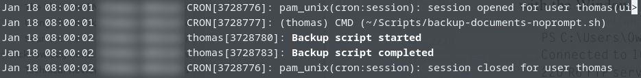

For the longest time, I've backed up my files to an external dual-bay 3.5" hard drive enclosure. I would do my backups manually, which didn't bother me a lot in the past, but I soon realized how much of a hassle it could be when you want to replicate the data on more than one drive and have to keep track of which is the most current. After I started to get more into working with servers (e.g., Windows Server and Ubuntu Server), I wanted to configure my own file shares. I chose to run Ubuntu Server on the Proliant DL360 for running VMs as well as hosting other services within the LAN, such as file shares.

In the case of my backup directory, I am using **rsync** as a remote file-copying tool. Under the hood, rsync uses SSH to establish the connection, using the client's public SSH key. Public-key authentication can be enabled within the SSH server's configuration. On the client system, you'll generate an SSH keypair with **ssh-keygen** and use the **ssh-copyid** command to send your public key to the server. Public-key authentication with SSH has the advantage of letting you authenticate without typing a password. This enables my backup script to do its job without making me physically provide the password. Remember to keep the corresponding private key safe and never share it with anyone or anything.

## Running a Backup Script with crond
I decided to write a bash script to run **rsync** in order to copy my documents to the Proliant. I added some extra conditional checks to make sure that the host could connect to the server's share directory via SSH. If the directory was found, then the backup could proceed, otherwise it would terminate and place an error entry in the journald log. Initially, I would invoke the script manually whenever I felt like doing a backup would be a good idea.

I read about **cron** and **cronjobs** in the past, and decided I'd try it out to enable the backup script to automatically run at specific times during the day. I found a convenient web site that helps with the crontab syntax (https://cron.help/). So far, the script and cronjob is working pretty well and I don't need to manually figure out which files I need to copy over, nor remember which files have been changed since the last backup. Rsync is capable of comparing the differences between a source and destination file to determine whether it should copy files over.

Unfortunately, rsync by itself is not very great for bi-directional synchronization. At the moment, the script only copies new and modified files to the server and does not pull files from it. I would need to add extra code in the script to perform both backups and restoration. I'd also need to implement some mechanism to keep track of which one of my computers were backed up last. It is on my bucket list to add bi-directional functionality in the future.

## The Script
Be sure to allow the file to be executable with `chmod u+x backup-documents.sh`.
I like to store scripts in my home directory, under ~/Scripts. `~/` is a short-hand for the current user's home directory.
Replace "_someuser_" and "_serveruser_" with an appropriate name. You may be able to omit _serveruser_ in the server path (`server-name:/mnt/RAID5/someuser/Documents/`), but I've not tested this yet. Be sure to modify the paths according to your situation. For instance, my server has a filesystem mounted under "_/mnt/RAID5/_" and a directory named after my user name.

<code>#!/bin/bash
if ssh someuser@server-name '[ -d "/mnt/RAID5" ]'; then
  echo "Directory found"
  logger Backup script started
  rsync -Pau ~/Documents serveruser@server-name:/mnt/RAID5/someuser/Documents/
else
  echo "Could not connect to the server (or find RAID5 directory)..."
  logger -p user.err Backup script failed to find destination
  exit 1
fi
logger Backup script completed
</code>

## Adding a cronjob:
Open a new shell terminal and type `crontab -e` to modify your user account's crontab file. This command, with the **-e** option, will take you to an editor. Scroll to the bottom of the file and add a line similar to the following:

<code>0  8,20  *  *  *  ~/Scripts/backup-documents.sh</code>

This tells crond to run the script every day at 8AM and 8PM. You can change this to whatever you want. It is very flexible, in terms of exactly when you want a cronjob to run (e.g, every other day, once a month on a specific day of the month, etc). Viewing the `/etc/crontab` file shows an example of a job definition and "https://cron.help/" provides a useful tool to make definitions.

\
*Viewing journal entry with journalctl*

Sure, I could have downloaded and installed an all-in-one backup solution, but sometimes I like writing my own scripts/programs. It gives me a constructive reason to write shell scripts and gain more hands-on experience with it as well. For a simple backup solution with rsync, I think the script works really well. I did a few tests to ensure that rsync is running correctly and that the cronjob runs when it's supposed to. I've also tested the condition test by disconnecting the server to make sure that the script produces the expected error output as a log entry.

One of my main concerns is with the power consumption of the Proliant and the 7 SAS disks that are running in it. The SmartArray controller does have options for tuning the power consumption and I set it somewhere in between. Considering how infrequently the array is accessed, it'll probably be best to enable maximum power savings to ensure that the disks don't run all the time. I'll have to see if there are any power-related settings in Ubuntu as well.
There's also a RAID10 array in the system for my virtual machines, but I'm not sure if enabling maximum power savings will greatly impact their performance. I believe I set the power saving to somewhere in the middle and the VMs seem plenty fast for me. I may try the maximum power savings to see how it really affects performance and if the VMs still load quickly then I'll keep it there. I have a power meter to monitor my main desktop's consumption so I might move it to the server to see how much the server is costing me to run.

