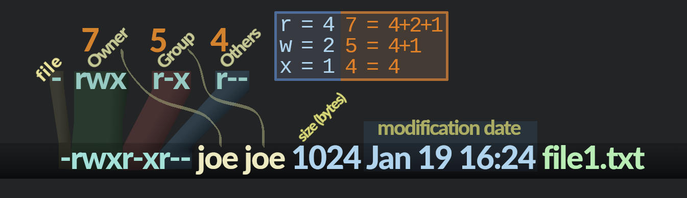
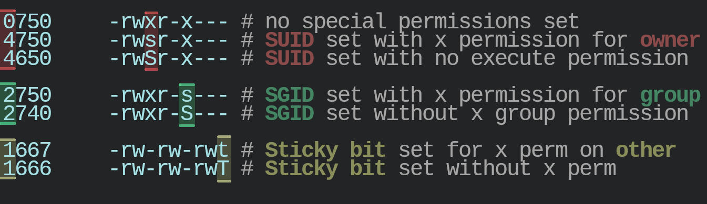

The permissions of a file(s) can be listed with <code>ls -l</code>.
The <code>stat _filename_</code> command displays detailed information about a file's attributes, which include the file owner/group, access and modify dates, size and permissions.
Each file has a set of permissions for **owner**, **group**, and **other** which may each have their own set of permissions, depending on the requirements.
There are three main permissions: **read**(r), **write**(w), and **execute**(x).
Below is an example of **ls** output showing a file that has the following permissions:
- Owner: rwx (read,write,execute)
- Group: r-x (read,execute)
- Other: r-- (read)
\
*Diagram showing meaning of ls output*

**Note** : execute permission on a directory enables one to traverse into the directory via **cd**. For instance, if **other** does not have execute permission on a directory, an _other_ user will get a "_Permission denied_" error when attempting to navigate into that directory.

## Special Permissions
Special permissions are basically a 4th level of access that provide some extra access controls.
This fourth level of access is represented by yet another digit that many new users may not have noticed, unless using the **stat** command which displays 4 octal values.
For example, a file's permissions may look like 0750 if there are no special permissions set as indicated by the first digit, on the left, being 0.
Like the owner, group and other permissions, the special permissions digit follows a similar 4+2+1 convention as follows:

\
*Special permissions on owner, group and other*

- If SUID is set when owner has execute permission, then then the file will be executed as the owner for everyone who executes that file. If the owner does not have execute permission, then the lowercase '**s**' is replaced with an uppercase '**S**' to distinguish between the owner having execute permission or not.
- If GUID is set, then the file can be executed as the owning group. If set on a directory, then any files created within that directory will have group ownership set to owner of the directory. For instance, if Joe created a new file in a folder owned by Jerry, then the file will be owned by Jerry, but its group ownership will be Joe. If the group execute permission is not set, then an uppercase '**S**' is shown.
- If the Sticky Bit is set on a directory, any files (or directories) can only be deleted by their owner.

## The umask
The umask modified the default permissions for files/directories that a user creates. On my Debian system's user account, the default umask is **0022**.
The default permissions 777 (files) and 666 (directories) are modified by the umask to establish the effective permissions for any new files that are created by the user.
- 0 : no permissions removed
- 1 : execute bit removed
- 2 : write bit removed
- 4 : read bit removed

### End
This text, so far, is my current understanding of how permissions work on *Nix systems. I find that creating my own little diagrams and typing things out helps to etch concepts in my brain. As I continue my journey, I hope to improve my documentation as time goes by (possibly correcting any inconsistencies that I may find later in the future). I find drawing diagrams to be a little fun and it really helps with memorization.

For a umask of 0022 against default permissions 777 (directories) yields effective permissions of 0755 for directories.
For files, the effective permissions will be 0644.
