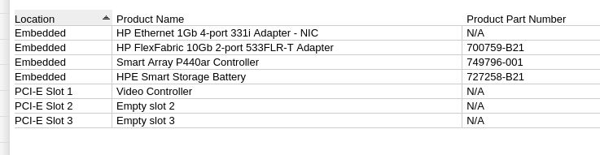
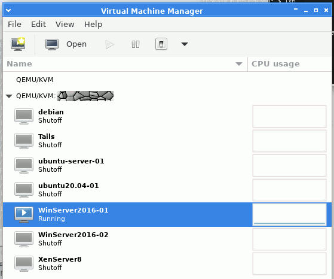

A while ago I got my hands on a used HPE Proliant DL360 Gen9 for cheap.
There was some structural damage on the chassis that prevented certain drive caddies
from being inserted properly. After removing the hardware, I was able to straighten
out the chassis so that the caddies would fit in all of the available spaces.
The POST was successful and even the smart storage battery is healthy.

\
*Hardware listing in web-based ILO4 interface*

After looking through the UEFI settings and figuring out how to access the Smart
Array Controller, I popped in a single 120GB SSD for the OS and four 2.2TB SAS
disks. I placed those four in a RAID10 array and allocated about 1/3 of the space
for a single partition to hold the virtual drives.
I chose Ubuntu Server 22.04.3 for the OS which runs KVM/QEMU for the VMs.

Later on, I added another three 146GB 15k RPM SAS disks. They're
pretty small, but I was mainly interested in testing the performance of a RAID5 array.
It gave me just under 300GB to work with. Despite setting up the RAID5 array to
do a benchmark, I ended up leaving it there and setup a Samba file share to mess with.
I wrote a shell script that uses rsync to backup my documents and it works pretty well.
Preferably, I'd like to build a small and low-power system for backups someday.
Aside from the Proliant, I've got an external USB drive enclosure that I use sometimes.

So, now there's a RAID10 and a RAID5 array in it. The Ubuntu Server installation
went well on the 120GB SSD and it took me a couple days to learn and figure
out how to setup the virtualization with KVM/QEMU. Its default configuration
wanted to store the VM disks on the tiny SSD so I figured out how to configure
libvirt to use a directory on the much larger RAID10 volume.

The server has been running great over the past month, but it's a little dusty
already. I've been using SSH with public-key security to access the server
from my regular desktop. I also use Virtual Machine Manager on my desktop
as well to remotely manage the VMs and its Spice client to control the
VMs.

It's amazing. The server is tucked away and I found the ILO subsystem useful
for rebooting or checking the state of the server if, for some reason, the OS fails to
boot. However, there were some cases where I needed to interact directly with
the server to troubleshoot some issues with Ubuntu.
When everything is running right, I can work with the system remotely from
the comfort of my main desktop.

